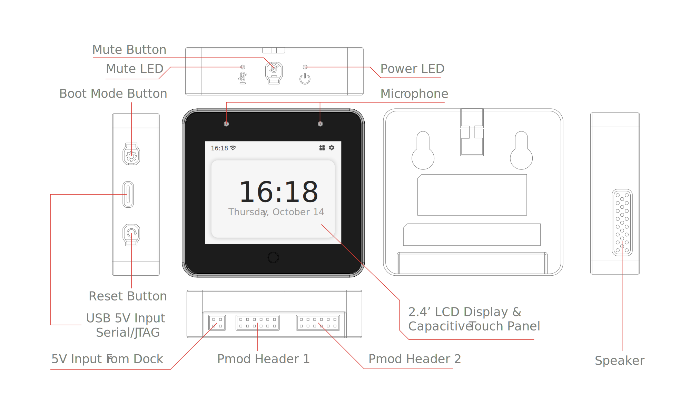
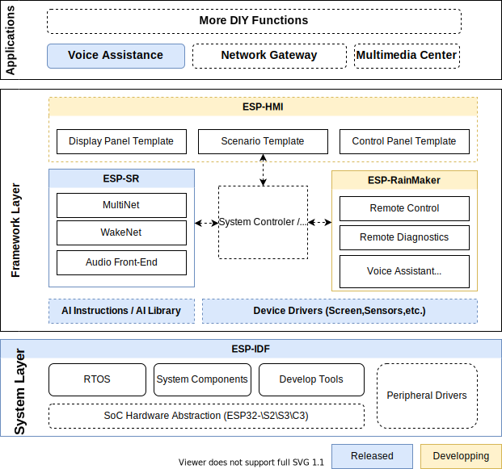

* [English Version](./README.md)

# ESP-BOX 开发者指南

ESP-Box 是乐鑫信息科技发布的新一代 AIoT 应用开发板，搭载乐鑫 ESP32-S3 SoC，支持 AI 加速指令和 Wi-Fi + Bluetooth 5 (LE) 无线功能。ESP-Box 内置 2.4 英寸 LCD 电容式触摸显示屏，双麦克风，扬声器，和两个 Pmod 兼容的多功能扩展接口。配合开箱即用的语音唤醒和识别功能，以及开源开发框架和示例程序，开发者基于 ESP-Box 可以更快更好的构建各种有趣的 AIoT 智能应用。

## 硬件总览

* [ESP-BOX Mainboard Schematic](./docs/hardware/schematic/SCH_ESP32-S3-BOX_V2.5.pdf)
* [ESP-BOX Mainboard PCB](./docs/hardware/pcb/PCB_ESP32-S3-BOX_V2.4.pdf)

### 规格参数:

### 接口:

* [Digilent Pmod™ Interface Specification](https://digilent.com/reference/_media/reference/pmod/pmod-interface-specification-1_3_1.pdf)

## 技术架构

ESP-BOX 开发框架包括系统层、框架层、应用层三个主要层级：

### 系统层 System Layer

ESP-IDF 是乐鑫官方开源操作系统框架，同时兼容 ESP32、ESP32-S 和 ESP32-C 系列 SoC，完成一次开发即可在多芯片平台部署。它集成了大量的系统级基础组件，用于代码编译和调试的开发工具集，以及详尽的开发指导文档，具体包括：
1. 系统级基础组件，主要包括基于 FreeRTOS 的多任务、多核支持，可外扩 PSRAM 的内存堆分配器；多款 ESP 芯片的 LL、HAL、Driver、VFS 层支持，将不同芯片功能抽象为统一操作接口；多个标准网络协议栈 TCP/IP、HTTP、MQTT、WebSocket 等等；
2. 开发工具集，主要包含用于代码编译的 GCC 交叉工具链、基于 OpenOCD 的 JTAG 调试工具、基于 Segger SystemView 的实时跟踪、Flash 和 eFuse 编程器等；
3. 开发指导文档，详尽的说明了乐鑫各个芯片平台、各个软件版本下的 API 参考，使用指引和注意事项等，开发者可[在线浏览](https://docs.espressif.com/projects/esp-idf/en/latest/esp32/get-started/)也可[下载到本地](https://docs.espressif.com/projects/esp-idf/en/latest/esp32/esp-idf-en-v4.4-dev-3540-g4e03a9c-esp32.pdf)查看。

### 框架层 Framework Layer

除了系统层支持外，ESP-BOX 还集成了多个出色的解决方案框架，分别处理不同功能场景下的典型问题。包括用于处理语音唤醒词和命令词的语音识别框架 ESP-SR，处理显示和触摸交互功能的人机交互框架 ESP-HMI，和处理物联网功能的端到端物联网开发框架 ESP-RainMaker，接下来将简要介绍这些解决方案框架的功能和定制化方法：

**ESP-SR**

ESP-SR 是乐鑫面向智能语音领域开发的语音识别框架，该框架可利用 ESP32-S3 AI 扩展指令进行运算加速，为开发者提供开箱即用的高性能、高可靠性的语音识别功能，它包括：

1. 声学前端（[Audio Front-End, AFE](https://github.com/espressif/esp-sr/tree/master/acoustic_algorithm)）算法集，用于提升智能语音设备在远场噪声环境中的交互能力，使开发者获得高质量且稳定的音频数据。它主要包括可以有效滤除扬声器回声的回声消除算法（Acoustic Echo Cancellation，AEC）, 用于强化麦克风阵列方向性的盲源分离算法（Blind Source Separation，BSS），和用于处理环境噪声的噪声抑制算法（Noise Suppression，NS）。ESP-SR 将以上算法封装成简单的 API，开发者无需关心这些算法的具体细节，只需要针对具体的应用场景，对需要使用的算法排列组合，并按照 API 的格式要求输入待处理的语音数据，即可得到声学前端算法的处理结果。
2. 唤醒词识别模型（[WakeNet](https://github.com/espressif/esp-sr/blob/master/wake_word_engine/README.md)），用于在连续的音频流中实时监测出特定的语言片段，将智能设备从待机状态唤醒至语音交互状态。WakeNet 通过计算音频片段的梅尔倒频谱（Mel-Frequency Cepstrum, MFC）作为输入特征，使用针对 ESP32-S3 优化的神经网络算法对特征信号进行分类，在监测到命令词时触发唤醒信号，可在噪声环境下获得不小于 80% 的[有效识别率](https://github.com/espressif/esp-sr/blob/master/wake_word_engine/README.md#performance-test)。ESP-BOX 提供了开箱即用的离线唤醒词 “Hi, ESP” 和 “Hi, 乐鑫”，开发者无需额外的开发工作即可使用，同时乐鑫也支持为开发者[定制独特的唤醒词](https://github.com/espressif/esp-sr/blob/master/wake_word_engine/ESP_Wake_Words_Customization.md)。
3. 命令词识别模型（[MultiNet](https://github.com/espressif/esp-sr/blob/master/speech_command_recognition/README.md)），用于在设备唤醒后，识别用户特定的中英文语音命令，例如 “Turn on the air conditioner”，“关闭电灯” 等。MultiNet 通过基于 CRNN 和 CTC 的卷积循环神经网络，对输入音频片段进行多命令词识别，可同时支持最多 100 个离线命令词。 开发者不需要了解识别模型细节，也无需重新进行模型训练，通过简单配置[中文拼音字符串](https://github.com/espressif/esp-sr/blob/master/speech_command_recognition/README.md#chinese-speech-command-recognition)或[英文音标字符串](https://github.com/espressif/esp-sr/blob/master/speech_command_recognition/README.md#english-speech-command-recognition)以及对应 ID，即可添加或修改命令词，模型在识别到语音命令词后将触发包含 ID 信息的事件。

**ESP-HMI**

ESP-HMI 是乐鑫基于开源 GUI 框架 LVGL 设计的人机交互方案，借助 ESP32-S3 强大的计算能力和外设资源，可以实现出色的数据可视化、触摸控制等功能，它包括：
1. 屏幕驱动库：兼容多款主流 8080、SPI、I2C 接口彩色屏幕、单色屏、触摸屏，提供统一的显示驱动接口。开发者可以直接使用已适配的屏幕控制器，也可根据显示驱动接口添加自己的屏幕，UI 界面开发完成可无缝部署到多种屏幕。
2. 开源 UI 模板：乐鑫设计了适用于物联网控制面板、多媒体播放器、语音助手等不同物联网场景的多套开源 UI 模板，帮助开发者进行更专业的二次开发。
3. 硬件参考设计：提供屏幕应用相关的硬件参考设计、电路原理图和开发指南，帮助开发者快速完成硬件设计。

**ESP-RainMaker**

[ESP-RainMaker](https://rainmaker.espressif.com/docs/get-started.html) 是一个完整的物联网开发框架，作为一个端到端平台，可以为开发者提供设备配网、连云、OTA 等一站式的物联网产品功能和示例。它包含：
1. 设备端 SDK，开发者通过设计设备参数和属性，即可使用乐鑫芯片定义自己的物联网产品，快速完成设备端固件开发;
2. 透明的云中间件，开发者无需管理设备证书和云端基础设施，直接使用乐鑫芯片即可快速建立与云端的建立安全的通信链接；
3. iOS / Android 平台 APP，集成了设备发现，Wi-Fi 配网，用户登录，设备关联和控制等必要功能，开发者无需进行额外的代码开发工作。

**AI 指令集和库**

借助 ESP32-S3 Xtensa® 32­bit LX7 双核 CPU 和 AI / DSP 扩展指令集，ESP32-S3 可高效完成向量运算、复数运算、FFT 等运算，加速神经网络计算和数字信号处理计算能力。AI 开发者们可以基于乐鑫开源的基于 AI / DSP 扩展指令集的软件库，实现高性能的图像识别、语音唤醒与识别等应用。

**设备驱动 Device Drivers**

TBD:

### 应用层 Application Layer

TBD:

## 开发指引

1. [搭建开发环境]()；
2. 尝试编译几个[示例程序](./examples)；
3. 查阅 [编译系统](https://docs.espressif.com/projects/esp-idf/en/latest/esp32s3/api-guides/build-system.html) 可以进一步理解程序的编译链接过程；
4. 查阅 [应用程序启动流程](https://docs.espressif.com/projects/esp-idf/en/latest/esp32s3/api-guides/startup.html) 可以更好的理解 ESP 固件程序的运行流程；
5. 查阅 [配置命令词]() 定义自己的专属命令词；
6. 查阅 [LVGL 快速总览](https://docs.lvgl.io/latest/en/html/get-started/quick-overview.html) 学习如何添加一个喜爱的 GUI；
7. 查阅 [ESP-IDF API 参考手册](https://docs.espressif.com/projects/esp-idf/en/latest/esp32/api-reference/index.html) 为 Pmod 外接设备开发驱动；
8. 如果你有问题，可添加 [GitHub Issues](https://docs.github.com/en/issues) 或者到 esp32.com 论坛寻求帮助；
9. 如果你对 ESP-BOX 项目感兴趣，欢迎贡献代码 [Pull Requests](https://docs.github.com/en/github/collaborating-with-pull-requests)。
